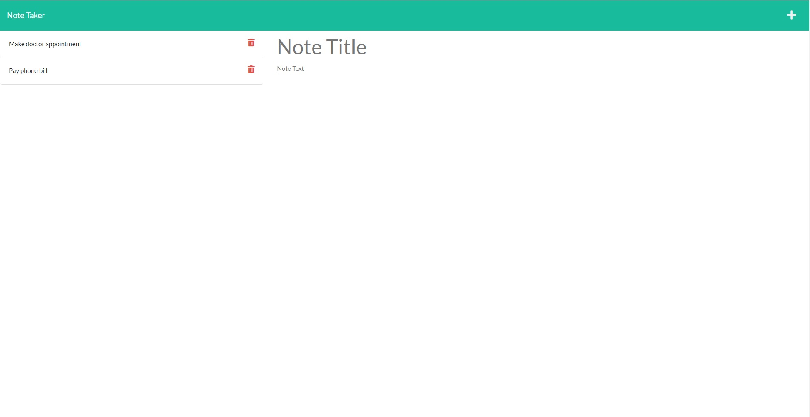

# Express Note Taker

## Description

A simple application built with **Express.js** that can be used to write, save, and delete notes.

My motivation for this project was to familiarize myself with using **Express.js**, as well as using the NPM package **UUID** for handling unique IDs.

I learned how to properly manage a backend with **Express.js**. I also learned how to handle DELETE requests to delete data.

## Installation

Type the following npm command to install all the dependencies:

```
npm install -y
```

## Usage

Deployed link: https://nork-note-taker.herokuapp.com/

If repo is cloned, then to use this application, you must start the server with:

```
npm start
```

Once you have started the server, you can navigate to http://localhost:3001/ in your browser. Upon loading the application, click the **Get Started** button. Type a note title, and note text in the fields, and click the save button in the upper right. To delete, simply click upon the trash can icon next to the note in the left column. You can also click the note text in that same column to bring the note back to the body.



## Credits

Starter Code - https://github.com/coding-boot-camp/miniature-eureka

Express Documentation - https://expressjs.com/en/4x/api.html#express

UUID Package - https://www.npmjs.com/package/uuid

Heroku Git Article - https://devcenter.heroku.com/articles/git